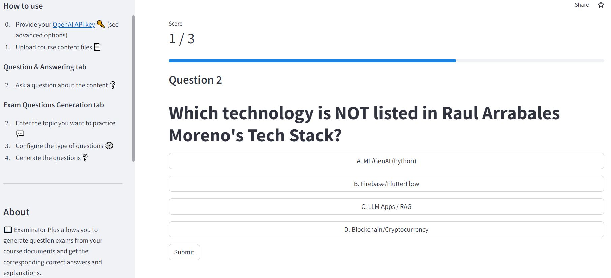

# Examinator Plus

**Examinator Plus is an AI-Assisted App that generates exam questions**. It is written in Python and utilizes the following components: 
- Streamlit for the web interface. 
- Langchain for LLM-app orchestration and doc ingestion/chunking. 
- OpenAI ADA Embeddings for document vectorization.
- OpenAI Chat Completion API for LLM-based generation (aka ChatGPT API).
- FAISS for in-memory vector indexing. 

### Sample question generated from my CV

### App in Streamlit Hub

Try the app at https://examinatorplus.streamlit.app/ 
